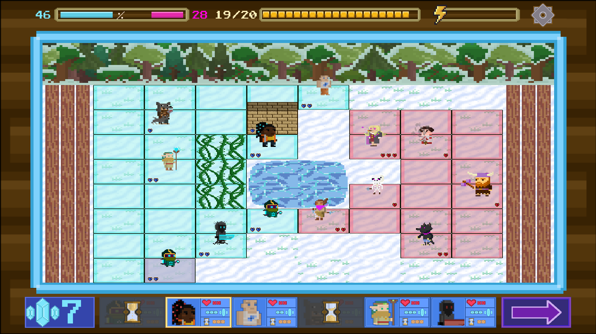

# Proyectos2-2020-21
# **P A I N T L E S S**

Documento de diseño de juego

---------------------------------

**Grupo 3 - NoName’s Studios**

*Manuel Adeliño Consuegra | Jonathan Sebastián Andrade Gordillo | Rubén González Ortiz | Alberto Gómez Castaño | Simeon Konstantinov Petrov | Javier Meitín Moreno | Mario Miguel Cuartero | Adrían Migueles D’Ambrosio | Alejandro Ortega Ruiz | Nicolás Rosa Caballero*

| **Géneros:** Turn-Based-Strategy | **Modos:** Multijugador online y local |
| --- | --- |
|| **Plataformas:** Windows x64 |

**Descripción:**
Descripción: PaintLess es un juego multijugador de estrategia por turnos en el cual los jugadores disponen de un amplio abanico de personajes con distintas habilidades de los cuales deben seleccionar seis. El juego se desarrolla en un tablero 8x10 donde los jugadores deben mover a sus diferentes personajes para cubrir la mayor área de juego posible. Esto es debido a que según los personajes se mueven, colorean las casillas por las que se han desplazado. El ganador será aquel que pasado un número determinado de turnos, tenga cubierta la mayor zona del mapa coloreada.

## **Páginas de interés**
### [Página web](https://rubenglezortiz.github.io/Proyectos2-2020-21/)
### [Pivotal Tracker](https://www.pivotaltracker.com/n/projects/2489055)
### [Repositorio](https://github.com/rubenglezortiz/Proyectos2-2020-21)
### [Informe Testing/QA](https://docs.google.com/document/d/1SECKg8W8UhA9YVVsTymynRhNhotF5HouHmP8w92xcbc/edit?usp=sharing)

# Menú
## Menú principal

El esquema del menú principal es simple, con una disposición vertical y centrada de diferentes botones, cada uno con su respectiva función:
- Botón para  entrar al modo multijugador: Permite o bien crear un lobby para invitar a otras personas a través de un código o bien unirse a otro jugador introduciendo uno.
- Local: Permite elegir al jugador el número de jugadores, y jugar con otros jugadores usando el mismo equipo.
- Opciones: Permite modificar el volumen.
- Salir: Cierra el juego.

## Pantalla de controles
 
 Aparecen en un recuadro azul las funcionalidades del clic izquierdo y en un recuadro naranja las funcionalidades del clic derecho.
## Selección de personajes

 Antes de comenzar la partida, cada jugador debe elegir 6 personajes distintos de entre todos los distintos personajes para conformar su mazo. Este menú consta de 3 botones superiores los cuales permitirán al usuario separar a los personajes por tipos de habilidades y así ayudarle a formar su mazo. Cuando se pulse con el botón derecho sobre un botón de personaje, también se mostrará una tarjeta informativa con una pequeña descripción de las habilidades del personaje y de su lore.
 
## Menú de opciones (in-game)
Durante la partida, el jugador puede entrar en un Menú de ajustes. Dicho menú es una extensión del menú de ajustes inicial, al que se le suma un botón de rendirse para terminar la partida si así lo desea el usuario.

# Interfaz
Durante la partida, la interfaz muestra diferentes datos, como se puede apreciar en la siguiente imagen:

-En la esquina superior izquierda del tablero se refleja qué porcentaje del mapa tiene coloreado cada jugador. Esto es indicado mediante una barrita horizontal que ayuda a ver visualmente la diferencia.
-En la parte superior central de la pantalla, se indican los turnos restantes hasta que termine la partida.
-En la parte superior derecha también se aprecia el número de acciones que le quedan en dicho turno al jugador actual.

# Jugabilidad
## Mecánicas
Durante cada turno de la partida el jugador puede crear tropas en el tablero usando 10 de maná y moverse/atacar utilizando 5 puntos de acción, los cuales se regenerarán en cada turno.
Cada personaje dispone de una habilidad específica la cual puede usar para eliminar personajes enemigos, curar personajes aliados o moverse más rápidamente para aumentar la velocidad del pintado de mapa. Cada habilidad (salvo habilidades pasivas) se puede utilizar una única vez por turno.
Anotación: hay personajes que sólo pueden atacar, otros que sólo tienen habilidades y otros que tienen ambas.
### Sacar personajes (spawnear)
El jugador podrá sacar sus personajes en la columna base. Y, a medida que vaya pintando el mapa, podrá sacarlos en las dos primeras columnas de su parte del tablero (la de base y la siguiente). El gólem tiene una excepción, ya que al no poder moverse, podrá ser spawneado en las primeras 4 columnas de la parte del mapa del jugador. Siempre y cuando estén pintadas (a excepción de la columna base).
### Movimiento
El jugador puede mover cada personaje dentro del tablero gastando puntos de acción (1 movimiento = 1 punto). Todos los personajes se mueven de una casilla en una casilla (a excepción del alquimista), incluso intercalando movimiento con ataque. Los personajes se pueden mover en 4 direcciones (vertical y horizontal). Los personajes no pueden atravesarse los unos a los otros ni a muros u obstáculos.
### Ataque
Ciertas unidades pueden atacar a unidades del equipo rival. Dicho ataque varía en daño y alcance en función de la unidad, de hecho, hay unidades que no atacan (ver en la tabla de la siguiente página). Cada ataque gasta un punto de acción (1 ataque = 1 punto).  Cada personaje solo podrá atacar una vez por turno.
### Maná
El jugador dispone puntos de maná que le permite sacar personajes desde el mazo al terreno de juego. El coste de cada personaje viene indicado en la zona media de cada ficha. El máximo de maná es 10 y cada turno se regenera 3 puntos.

### Personajes
Para el transcurso de la batalla, el jugador puede sacar a los personajes clicando en un personaje y luego en la casilla de mapa que quiera sacarlo gastando maná. El jugador únicamente puede sacarlos en su zona de spawn + 2 filas pintadas.
Los personajes pueden atacar en 4 direcciones (vertical y horizontal) a excepción del lobo.

| SPRITE | VIDA | CD | MANÁ | DAÑO | PASIVA | ATAQUE / HABILIDAD | TIPO DE UNIDAD |
| --- | --- | --- | --- | --- | --- | --- | --- |
| PÍCARA  | 2 | 3 | 2 | 2 | Tiene 25% probabilidad de hacer x2 daño | Ataque | Ataque |
| ESQUELETO  | 1 | 1 | 1 | 1 | Cuando el esqueleto muere, es utilizable dos turnos más sin que este pueda ser eliminado de nuevo | Ataque | Ataque |
| VIKINGO  | 1 | 3 | 3 | 1 | Disparo a larga distancia (Alcance infinito, afecta al objetivo más próximo en la horizontal) | Habilidad | Ataque |
| KIRIN  | 2 | 3 | 2 | 1 | Atraviesa un aliado/enemigo/muro/enredaderas | Ataque y Habilidad | Ataque |
| DRUIDA  | 2 | 3 | 3 | 0 | Invoca 3 enredaderas pudiendo elegir en qué  lado ponerlas (delante, arriba, debajo o detrás). Al cabo de 4 turnos desaparecen. | Habilidad | Ataque |
| CAZADOR  | 2 | 2 | 2 | 1 | Alcance aumentado | Ataque | Ataque |
| TANQUE  | 3 | 2 | 4 | 1 | Regenera 1 de vida cada 3 turnos | Habilidad | Defensa |
| GÓLEM  | 4 | 3 | 4 | 1 | No se puede mover y deja un muro al morir de 1HP | Ataque Y Habilidad | Defensa |
| MONAGUILLO  | 1 | 2 | 3 | 1 | +1 HP a los aliados de 3x3 (Habilidad activa. Gasta 1 acción) | Habilidad | Defensa |
| ARQUITECTA  | 2 | 3 | 3 | 0 | Puede crear muros de 2HP a su alrededor (Habilidad activa. Gasta 1 acción) | Habilidad | Utilidad |
| BOMBA  | 2 | 3 | 3 | 0 | Al morir hace 1 de daño en 3x3 y pinta las casillas explotadas | Habilidad | Utilidad |
| ALQUIMISTA  | 2 | 3 | 3 | 0 | Su ataque stunea a los enemigos un turno y se mueve 2 casillas | Habilidad | Utilidad |
| LOBO  | 2 | 2 | 3 | 0 | Empuja a los enemigos 1 casilla. Afecta a 3 casillas. Si el empujado choca con un personaje, inflige 1 de daño a ambos | Habilidad | Utilidad |

### Obstáculos
| SPRITE | VIDA | DAÑO | DESCRIPCIÓN |
| --- | --- | --- | --- |
| MURO | 2 | 0 (1 Si el lobo empuja a un personaje y éste choca contra el muro) | Puede ser desplegado por la Arquitecta y el Gólem al morir |
| ENREDADERA | 1 | 1 Daño por turno a los que se queden atrapados en ella, se pueden mover los personajes a través de ellas. Únicamente recibirán daño si se quedan en la misma casilla que las enredaderas. No se  destruir | Desplegado por Druida |
| RIO/PINCHOS/HIELO | Indestructible | Si un personaje cae en el río/hielo (habilidad del Lobo) o choca con los pinchos, muere | Se encuentran desde el inicio en el mapa |
### Tablero

El tablero del juego será de 8x10 y forma rectangular, teniendo espacio para mantener un juego entre dos jugadores. 
En ambos lados del tablero están las bases (zonas de spawn) ocupando la columna de cada jugador (primera y última columna del tablero). Dichas bases no son casillas que se puedan colorear, si no casillas donde los personajes no podrán ser heridos ni tampoco podrán atacar y defenderse.- Sólo moverse.
El resto de casillas del tablero comenzarán sin color, y a medida que los personajes de cada jugador avancen las convertirán del color propio del jugador.
En el tablero también aparecerán obstáculos, los cuales no podrán ser atravesados por los personajes del tablero (a excepción del kirin).

## Dinámicas
### Objetivo del juego
El objetivo del juego es pintar el mayor número de casillas posibles que componen el tablero. Por tanto, el ganador de la partida será aquel jugador que al haberse gastado los turnos que forman una partida haya conseguido cubrir el mayor porcentaje de este. También existe la posibilidad de que un jugador se rinda a mitad de partida seleccionando la opción “rendirse” en el menú de ajustes.

### Combinaciones de habilidades
Lo que enriquece a Paintless es el distinto tipo de personajes que cada jugador puede escoger para formar su mazo y como puede explotarlos para desarrollar así distintas estrategias que le permitan ganar terreno. Dado que hay un total de 13 personajes, y cada jugador solo puede seleccionar 6 por partida, el juego es muy versátil, y  cada partida es única, motivando al jugador a que juegue más de una vez probando otros personajes y otras combinaciones.
Un ejemplo de las muchas combinaciones posibles es utilizar el Kirin, el cual puede atravesar obstáculos, para que salte por encima de un muro que haya puesto el enemigo así acabar con él, gastando un total de 2 puntos de acción.
Otra combinación es utilizar personajes de defensa como la arquitecta o la bomba humana a modo de escudos para ir avanzando en el tablero de manera segura o anular la ventaja de los posibles personajes de larga distancia que el otro jugador haya puesto en esa misma fila.

## Estética
### Ambientación y gráficos
El arte del juego es en Pixel 16-bit, tanto los jugadores como los mapas y los menús. Este consta de influencias fantásticas y medievales, debido a que el juego está ubicado en un espacio-tiempo fantástico-medieval. Los colores predominantes serán tonalidades vibrantes de verde, rojo, morado, amarillo y azul. 
La resolución será de pantalla completa.
### Experiencia de juego
El jugador toma el papel de un candidato a Adamantín (ver apartado Historia para más información), y combatirá con otros candidatos para obtener dicho puesto. La batalla transcurrirá por turnos y cada jugador podrá invocar a los diferentes guerreros del mundo, conocer sus historias y controlarlos por el tablero.
Ya que los candidatos combatirán para convertirse en Adamantines, las decisiones que tome el jugador en torno a las acciones del personaje serán decisivas y tendrá que pensar de manera estratégica para hacerse con la victoria.

# Contenido
## Historia 
El mundo ficticio en el que desarrolla el juego es un mundo fantástico medieval donde una asociación de 13 seres divinos conocidos como los Adamantines está al cargo de escribir y documentar la historia de todos los seres que habitan dicho mundo en un documento conocido como el Pergamino Celeste.
Durante milenios, los Adamantines han sido el grupo más influyente de todo el mundo, pues no solo comparten sangre con los dioses, sino que poseen un amplio conocimiento sobre los distintos países, lo cual a su vez les permite mantener una fuerte influencia sobre ellos. Recientemente, uno de los Adamantines fue expulsado del Consejo Diamante por infringir las normas establecidas 14000 años atrás y alterar el ritmo de la historia, y es por esto que los Adamantines han empezado una Guerra para poder declarar al nuevo Adamantín.
Los candidatos a Adamantín poseen la capacidad de invocar guerreros que un día lucharon por su propia causa, y hoy luchan a favor de cada candidato. Estos guerreros son nativos del mundo que los Adamantines se encargan de regir, pero cada uno vino de una diferente época y de un diferente lugar.
Los candidatos deberán demostrar sus cualidades como Adamantín mediante el buen control de estos personajes a los que invocan y su capacidad de pintar su historia y sus acciones.
## Mapas
Las partidas de Paintless se desarrollan en distintos mapas. Estos mapas son de distintos tipos, y aparecen de manera aleatoria. En estos mapas, también aparecerán obstáculos, también en posiciones aleatorias. Ningún personaje salvo el kirin podrá moverse a través de estos obstáculos. Cómo ya se ha mencionado, las bases de spawn se encontrarán en los laterales.

## Personajes
### Druida 
Ermitaño que entra en la guerra para preservar la naturaleza y ponerle fin a la destrucción que sucede. Es capaz de comunicarse con las plantas, y mediante un elixir que fabrica (cooldown) es capaz de mutarlas, haciendo que crezcan y atrapen a sus enemigos.
### Tanque 
Ex-militar que formaba parte de la División Alpha y era la mejor en su quinta. Pasó la mayor parte de su vida en el campo de batalla, y entabló muchas amistades con sus compañeros, a los que consideraba familia. Tras tener que presenciar la muerte de todos ellos, surge un cambio dentro de ella que la hace dejar la ofensiva para siempre y defender a todo el que pudiera en el campo de batalla.
### Pícara
Dentro de la ciudad, en los barrios más pobres se crió una mujer como arma cuyo objetivo es matar al objetivo que el cliente desea, ganándose la vida y escalando poco a poco al nivel más alto de la sociedad.
### Monaguillo
Niño huérfano que fue acogido por la Iglesia y le echaron de ésta por su conducta rebelde. Nunca atendía a las lecciones de misa o hacía las tareas, ni mostraba asertividad con nadie. Estaba en un entorno en el que no podía ser él mismo. Cuando le echaron, se aseguraron de que no pudiera cometer ningún acto rebelde y le revocaron las artes mágicas que poseía, dejándole solo con artes curativas. Al salir, tuvo que buscarse la vida y se topó con un grupo del ejército, y encontró el objetivo de su vida. Aunque no pudiera dedicarse a atacar, lucharía en la guerra utilizando sus artes curativas.
### Gólem
Un mago experimentando con una roca se dio cuenta que sus poderes no servían para invocar elementos de la naturaleza como sus compañeros, sino para dar vida a objetos inanimados. Así es como dio a luz a su grandioso colosal, pero una vez acaba la vida mágica de ésta vuelve a su estado original.
### Vikingo
Dentro de una aldea creció un niño cuyo objetivo era ser el luchador más fuerte y poderoso de la tribu. Cada día de su vida se lo pasó practicando su lanzamiento de hacha y con esfuerzo y dedicación se convirtió en el luchador más imprescindible de la tribu. En un abrir y cerrar de ojos, es capaz de matar una tropa enemiga a larga distancia.
### Arquitecta
Después de tener un pasado difícil donde sus padres le obligaron a ser arquitecta, ella detestaba el trabajo de sus padres. Una vez sus lazos acabó utilizando su técnica de arquitectura en la guerra para ver cómo sus creaciones eran destruidas y así autocomplacerse.
### Lobo
Durante años, muchos magos se han dedicado a dominar hechizos de invocación de distintos elementos de la naturaleza. Otros magos se dedican a experimentar con plantas. Una vez, un mago consiguió fabricar una planta cuyo fruto alberga poderes de los elementos de la naturaleza y pensando que esta era inutil se desechó de ella. Donde más tarde un lobo se comió la fruta del viento adquiriendo el poder de esta.
### Bomba humana
Criminal altamente peligroso al que le han dictado una pena de muerte. Le ofrecen la posibilidad de salir de la cárcel en el caso de que luche en la guerra a favor de la penitenciaria, pero le engañan y le colocan una runa en la espalda que se detona cuando llega al territorio enemigo.
### Kirin
Espectro de años atrás que vive paseándose por los campos de batalla. Lo único que alienta sus garbeos es la sed de sangre que nunca desapareció al morir. Extrañamente, el monaguillo es la viva imagen de su hijo, y por esto mismo Kirin pasa el tiempo que no está vagando por el campo de batalla con el monaguillo. No tiene capacidad de comprensión ni entendimiento pero en el monaguillo siente la calidez que sentía cuando murió mientras pensaba en su hijo.
### Cazador
En la cultura del bosque no se puede considerar a una persona cazador si no completó una prueba a los 10 años. Deben adentrarse solos en el bosque y no volver a la aldea hasta que traigan consigo a un animal fuerte para que sea su compañero, muchos niños no lo consiguen y mueren de hambre o incluso devorados por los animales que buscan. Nuestro cazador se encontraba solo y sin fuerzas, a punto de alcanzar la muerte, cuando un lobo solitario, que había perdido la manada se acurrucó junto a ella. Fue el inicio de su historia, en la actualidad viven juntos las batallas para que los humanos no amenacen la supervivencia del bosque.
### Alquimista 
Prodigio de la ingeniería y la alquimia que nunca ha sabido diferenciar entre el bien y el mal. Su ansia y curiosidad por la ciencia la llevó a realizar prácticas inmorales de las cuales se acabaron enterando las fuerzas armadas. En el día de su juicio, fue bien preparada y bombardeó el palacio de su ciudad, escapando por lo más alto. 
Ahora es una fugitiva que se ha refugiado en la guerra para que no sean capaces de encontrarla, y nadie sabe de su pasado excepto ella misma.
### Esqueleto
Tras tantas batallas los soldados caídos en combate han perdido todo aquello que una vez les hacía distintos y especiales. Ahora solo sirven como carne de cañón después de revivir como puro odio hacia el oponente.

# Modo de juego
## Multijugador local
Un usuario podrá jugar contra otro jugador en el mismo ordenador, es decir, dos jugadores.
Se comienza eligiendo las cartas del primer mazo del jugador 1 y acto seguido el del jugador 2. Una vez en el tablero de juego, los personajes se diferenciarán con sutiles toques de color para identificar a que jugador pertenece, azul o rojo.
El equipo azul será el del jugador que ha elegido en primer lugar su mazo, mientras que el segundo jugador tendrá el jugador rojo.
En la parte inferior aparecerá el mazo de cada jugador según a quien le pertenezca el turno. Cuando un jugador haya acabado podrá pulsar un botón para pasar turno. Estas distinciones entre equipos y mecánicas de turnos también se muestran en el modo Online.
## Online
El jugador que cree la sala será equipo azul y el que se una será equipo rojo. En este modo los jugadores no podrán ver las elecciones de cartas que ha hecho el contrincante, guardando así la estrategia que usará durante la partida.

# Primeros minutos de juego
Al empezar PaintLess, el jugador verá el menú de inicio en el que aparecerán 4 botones:
Multijugador online. Para jugar a partidas online con otros jugadores que estén conectados en el juego. Un jugador inicia la partida y otro podrá unirse a ella en el menú selección de personaje.
Multijugador local. El jugador podrá jugar a partidas desde el mismo ordenador con otro jugador que esté presente. Compartirán los mismos controles y se irán turnando para jugar la partida.
Opciones. El jugador podrá gestionar las diferentes preferencias de volumen que tenga: deshabilitar la música y los sonidos y cambiar el volumen de todos los sonidos en el juego.
Salir. El botón para cerrar la aplicación y salir del juego.
Sin importar qué tipo de multijugador escoja el jugador, procederá a la pantalla de selección de personaje, en la que ambos seleccionarán 6 personajes de entre los 13 personajes disponibles, y son estos 6 los que formarán el mazo de cada jugador. Al seleccionar un personaje, aparecerá dicho personaje resaltado, para indicar que se ha seleccionado. Dentro de este menú podrás consultar información de cada personaje.
Cuando los dos jugadores hayan seleccionado a sus respectivos 6 personajes, aparecerán en el tablero, y empezará el juego dando el turno al primer jugador.
Este dispondrá del mazo que ha formado antes (el cual aparecerá centrado abajo de la pantalla), y a la izquierda de este mazo aparecerá la cantidad de maná de la que dispone (10 puntos para empezar) y un botón para pasar el turno. Haciendo click izquierdo sobre un personaje de su mazo, aparecerán resaltadas en el tablero las casillas en las que puede spawnear dicho personaje, que al principio de la partida, son la primera columna del tablero para el jugador 1 y la última columna para el jugador 2. Si el jugador clica en alguna de estas casillas resaltadas, spawneará allí al personaje que haya escogido y se le restará el coste de dicho personaje al total de maná del que disponga. 
Una vez haya colocado al personaje en el tablero, podrá interactuar con él de la siguiente manera: si le da click izquierdo, aparecerán en azul las casillas a las que puede moverse y atacar a un enemigo si se encuentra en el rango de ataque (siempre que la unidad pueda atacar), y en rojo los personajes enemigos a los que puede atacar (en caso de haberlos). Cualquiera de estas acciones consume un punto de acción del jugador, el cual comenzará con 4.
Cuando el jugador 1 haya terminado de spawnear a sus personajes y haya hecho las acciones que quiera, se pasará el turno al siguiente jugador, el cual podrá también spawnear personajes y realizar acciones con ellos.
Cada turno de cada jugador en concreto restaura 3 puntos de maná al total que tenían, de manera que si el jugador 1 ha finalizado el primer turno con 5 de maná, en el segundo turno tendrá 8 de maná. En ningún caso el maná superará el valor 9.

# Diagrama UML

# Informe de pruebas QA
## HITO 1
### ¿Cómo hemos desarrollado el testing?
En el hito 1, el testing se enfocó a consolidar, dentro de lo posible, las mecánicas y habilidades de los distintos personajes que habíamos diseñado en el hito 0/principios del hito 1. Para realizar esto nos dividimos en parejas para jugar en papel/Paint/Photoshop, de tal manera que cada pareja debía probar unas dimensiones de tablero y atributos de personaje distintos. De este modo, fuimos capaces de debatir qué personajes eran más útiles, y qué número de vidas/maná/turnos era más óptimo para que la partida no se hiciese pesada. Aunque los 10 desarrolladores realizamos estas partidas de testeo durante un sprint entero, en sprints posteriores, algunos desarrolladores siguieron probando y comunicando al resto sus “hallazgos”. Es decir, el proceso de testeo y actualización de mecánicas ha sido un proceso fluido, dinámico, y continuo a lo largo de todo el desarrollo, con ciertos puntos de inflexión en algunos sprints, donde se le dio mayor protagonismo.

### Conclusión general de las pruebas:
En este hito establecimos los primeros cambios de balanceo de personajes, puesto que vimos que había una gran variabilidad de los mismos en cuanto a utilidad, ya fuese debido a que algunos personajes estaban muy “rotos” o que eran prácticamente inútiles.
Otra parte importante del testing viene dada por el cambio de tamaño del mapa, puesto que antes, al ser un mapa de 9x10, se tardaban demasiados turnos en empezar a tener combates entre los jugadores.
Por último, aclaramos varias dudas que teníamos acerca del comportamiento de los personajes que no se definieron de manera concisa en el GDD.

### Cambios que hemos realizado:
Las dimensiones del mapa cambian (9 x 10 -> 8 x 10).
La vida del Druida es demasiado alta (se baja de 4 a 2).
El Vikingo tiene poco cooldown (se sube a 1 a 3).
El Gólem no tiene una funcionalidad tan útil como el resto de personajes. Queda pendiente de balanceo en el hito 2.
Las enredaderas hacen daño a personajes tanto enemigos como aliados.
La habilidad de la Arquitecta se podía ejecutar en casillas donde no se debía poder ejecutar.
La habilidad del Vikingo atraviesa muros. Se cambió para que no pudiera atravesarlos.

### Problemas y/o limitaciones que hemos tenido
Dado que estas formas de testeo no requerían de tener nada implementado en el proyecto, no hubo ningún impedimento para realizar estas pruebas.

## HITO 2

### ¿Cómo hemos desarrollado el testing?
En el hito 2 terminamos de programar las habilidades de todos los personajes, por lo que fue más fácil poder probar las mecánicas y dinámicas del juego, que era el objetivo principal de este testing.
Para hacer pruebas, nos pusimos de 2 en 2 y mantuvimos partidas el uno con el otro, en las que prestábamos atención a las interacciones de los personajes con el entorno, con otros personajes y con la interfaz. Todo aquello que daba fallos o no funcionaba correctamente, lo anotamos y pusimos en historias de Pivotal Tracker para realizar las modificaciones pertinentes. 

### Conclusión general de las pruebas
En general, las mecánicas que habíamos implementado funcionaban correctamente, pero a veces desencadenaban errores al ejecutarse, ya que había algunos cálculos de comprobación de las casillas que no se realizaban correctamente, y por tanto daban lugar a excepciones.
También encontramos que algunos personajes todavía necesitaban más balanceo, por lo que tuvimos que hacer un proceso de cambios para ajustar los personajes a sus necesidades. 
A su vez, había algunos errores, como por ejemplo, que las casillas no se pintaban correctamente y que se podían atacar a los personajes aún estando en base.

### Cambios que hemos realizado
· Aumento de casillas con posible spawneo del Gólem (2 -> 4)
· Corregido un bug del cazador que podía atacar a través de obstáculos.
· Las casillas de la base ya no se pueden pintar.
· El Vikingo puede atacar en la dirección en la que esté el enemigo en vez de solo hacia la derecha.
· La Bomba ya no provoca excepción al explotar en los bordes de la pantalla.
· La Pícara ahora hace más daño (normal 1->2 - crítico 2->4).
· Los personajes muertos ahora se eliminan correctamente del vector de entidades.
· El Gólem ahora deja muro al morir.
· El shader de las habilidades se borra cuando se pasa de turno.
· Ya no se puede spawnear un personaje encima de otro.
· El Kirin ahora salta enemigos correctamente.
· El movimiento de los personajes ahora funciona correctamente.
· El Druida ya no provoca excepción al dejar enredadera.
· La habilidad del Monaguillo ya no provoca excepción cuando se ejecuta en los bordes de la pantalla.

### Problemas y/o limitaciones que hemos tenido
En cuanto a problemas y limitaciones, nos encontramos con que no pudimos dedicarle el tiempo que hubiéramos querido para hacer el testing, ya que teníamos bastantes tareas de desarrollo y las priorizamos al testing, puesto que en el hito 3 ya íbamos a realizar un QA.
Este testing estuvo principalmente enfocado a comprobar que las habilidades desempeñasen su correcto funcionamiento según estaban especificadas en el documento de diseño y a resolver errores de ejecución que pudieran haber surgido.

## HITO 3

### ¿Cómo hemos desarrollado el QA?
Como ya hemos mencionado con anterioridad, hemos estructurado la planificación del proyecto de tal manera que la gran mayoría, si no todas las mecánicas estuviesen implementadas en el proyecto una vez finalizado el hito 2. Esto fue con el fin de poder realizar el QA a lo largo del tercer y último hito, orientándolo en torno al feedback que habíamos recopilado en algunas pruebas de testeo previamente realizadas, ya hubiesen sido realizadas por nosotros mismos (los desarrolladores), o por usuarios “desechables”. 
Hemos realizado el QA con un grupo de unas 20 personas, de las cuales 15 han respondido a las preguntas del siguiente cuestionario.
Este cuestionario gira, principalmente, en torno a qué dificultades se han encontrado los usuarios a la hora de interpretar y aprender a utilizar las distintas mecánicas, ya fuese debido a la complejidad de los controles, o a la gran variedad de personajes. También hay preguntas relacionadas con la estética: animaciones, sonidos, y diferencia de colores en los respectivos niveles. Por último les preguntamos si habían detectado algún bug y dejamos una última pregunta para que nos diesen sus opiniones y cambios que quisieran realizar.

### Ejemplos de preguntas y respuestas:

### Conclusión general de las pruebas
Como se aprecia en las imágenes y ya habíamos predicho (basándonos en algunas pruebas de testeo que habíamos realizado previamente), todo aquello relacionado con el diseño de la interfaz, personajes, y los sonidos y animaciones que habían sido implementados han tenido una recepción positiva por parte de los usuarios. Por otro lado, los distintos controles resultaron bastante confusos, no solo debido a que no venían explicados en el juego, si no que muchas acciones importantes como spawnear o atacar solo se podían realizar con el click derecho, y por costumbre, se suele utilizar el botón izquierdo en la amplia mayoría de aplicaciones existentes en todo el mundo.
Tras ver los resultados de los cuestionarios, llegamos a la conclusión de que había que cambiar algunos controles para que fuesen más intuitivos, retocar algunos aspectos estéticos, y balancear algunos personajes como el Vikingo.

### ¿Cómo se ha aplicado la información del QA en el proyecto?
A partir de las estadísticas que hemos obtenido con el formulario del QA, se han hecho modificaciones en el proyecto con el motivo de mejorar la calidad del mismo. Tras reunir tanto bugs como sugerencias, y debatir todos los miembros del equipo, decidimos implementar la mayoría de las sugerencias que nos habían hecho (pues creíamos que podían resultar beneficiosas y mejorar la experiencia de juego) y corregimos los bugs.
A su vez, y aunque no hubiese preguntas concretas de ello, nos fijamos en cómo reaccionaban los usuarios a la interfaz, al desarrollo del juego y a la estética de este, y anotamos los aspectos que nos parecían relevantes y/o a cambiar.
Para seleccionar los personajes, algunos usuarios no entendían por qué se pasaba de una pantalla (la del jugador 1) a otra (la del jugador 2), por lo que hemos añadido unos iconos que indican qué jugador está eligiendo en esa pantalla.
Al empezar la pantalla de juego, muchos de los usuarios necesitaban ser guiados para poder empezar a jugar, por lo que hemos añadido una pantalla de controles accesible desde el menú de opciones. 
Como no les resultaba muy indicativo, hemos añadido también un resaltado en las cartas del mazo que se activa cuando el usuario coloca el cursor sobre alguna de las cartas del mazo, indicando qué carta se va a sacar.

### Cambios que hemos realizado:
· Retocado sprites que hacían overlapping (HP, UI, casillas pintadas).
· Añadida la capacidad de ataque al golem.
· Arregladas algunas animaciones que crasheaban el juego.
· El vikingo no hace daño a los personajes que estén en base.
· Arreglamos el borrado del ability/movement shader.
· Se puede elegir personajes tras jugar una partida (BUG).
· La barra del volumen se ajusta.
· El alquimista tiene movilidad de 2 casillas.
· El hombre bomba explota correctamente (BUG).
· Ambos equipos ahora tienen la misma cantidad de turnos (BUG).
· El vikingo puede atacar a un enemigo que se encuentre en una enredadera.
· Los muros son atacables (BUG).
· El botón de opciones es funcional.
· El ataque del vikingo no atraviesa muros (BUG).
· Las casillas en las que haya obstáculos son de color nulo.
· Aumentada la cantidad de acciones por turnos a 5.
· Añadido un indicador de turno para cada jugador.
· Rediseñado el sprite del movement shader.
· Rediseñado el sprite de la alfombra (Tileset castillo).
· El juego no se cierra al pulsar Esc.
· Añadido un botón de pasar turno.
· Cambios de balanceo al cazador (Aumento de vida +1).
· Cambios de balanceo al hombre bomba (Reducción de vida -1).
· Cambios de balanceo al tanque (Reducción de vida -1).
· Reducido el número de turnos de las enredaderas.
· Cambios de balanceo al vikingo (Aumento de cooldown y maná +1).
· Rediseño de cartas de spawn para que el maná sea más reconocible.
· Cambio de controles (Spawn con click izquierdo y casteo de habilidad con click derecho y click izquierdo para ejecutar).
· Se recupera un total de 2 de maná cada turno.
· Se destacan las cartas de spawn.
· Ya no se puede atacar a un personaje si está en base (BUG).

### Problemas y/o limitaciones que hemos tenido
En cuanto a problemas, no esperábamos tener tantas sugerencias ni información como la que tuvimos. Por una parte, fue beneficioso para el proyecto pues recaudamos bastantes datos para mejorarlo, pero por otra, al hacerlo en el hito final, nos encontramos ante demasiadas sugerencias comparado con el relativo poco tiempo en el que también teníamos tareas principales de desarrollo pendientes, las cuales debimos compatibilizar. Esto ha ocasionado que los últimos sprints del desarrollo estén más cargados de lo que habíamos previsto, con el fin de poder meter todas las sugerencias que consideramos oportunas. Aunque no ha sido necesario realizar ningún crunch, el aumento de trabajo si ha sido notable. (Si lo midiésemos en puntos, se trataría de un incremento del 42%, habiendo aumentado la cantidad de puntos de un sprint de unos 35 puntos a más de 50.)

Algunas limitaciones que hemos tenido han sido que no hemos podido testear el modo online en el QA, pues según nuestra planificación el online tenía que hacerse a mediados del tercer hito, e hicimos el QA a principios. Esto conllevó a que no tuviéramos posible información que hubiéramos obtenido de haber podido probar el online con gente que nunca ha jugado a nuestro juego.

# Gestión del proyecto
La gestión del proyecto se ha llevado a cabo a través de Pivotal Tracker, desglosando el gdd en historias de usuario y estimandolas para luego repartirlas entre los miembros del grupo.

# Comunicación en el proyecto
La comunicación del proyecto se ha realizado mediante Discord, donde nos juntamos para las reuniones del grupo a lo largo de la semana, trabajar en conjunto y compartir las ideas y recursos en los distintos canales de texto y voz que creamos para una mayor organización.
